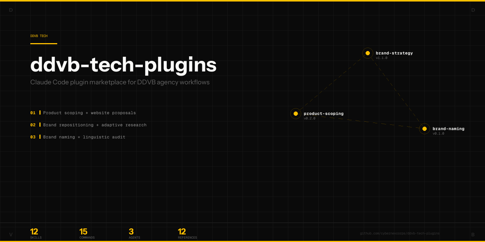

# DDVB Tech Plugins



[](https://claude.ai/code)
[](.)
[](.)
[](.)
[](.)

Claude Code plugin marketplace for **DDVB branding agency** workflows — product scoping, brand strategy, brand naming, and commercial proposals. Each plugin encodes the agency's real production methodology into repeatable, AI-assisted pipelines.

---

## Plugins

### ddvb-product-scoping `v0.2.0`

Product scoping from brainstorming to blueprints, and commercial proposal generation in the ddvb.tech website format.

| Component | Count |
|-----------|-------|
| Skills | 2 — `product-scoping`, `commercial-proposals` |
| Commands | 2 — `/create-proposal`, `/scope-product` |
| References | 4 — TypeScript schema, HTML patterns, CSS catalog, blueprint template |

**Key features:**
- Dual-layer proposal output: TypeScript data + HTML body for `ddvb.tech/proposals/{slug}`
- Dark cinematic theme with `proposal.css` classes (Atyp fonts, gold accents, reveal animations)
- 14-section technical blueprint from brainstorming materials

### ddvb-brand-strategy `v1.1.0`

End-to-end brand repositioning workflow with adaptive competitive research, SWOT/competitive analysis, brand platform development, and PPTX generation.

| Component | Count |
|-----------|-------|
| Skills | 4 — `brand-research`, `parallel-research`, `visual-generation`, `presentation-assembly` |
| Commands | 5 — `/brand-full`, `/brand-spec`, `/brand-plan`, `/brand-review`, `/brand-execute` |
| Agents | 3 — `research-analyst`, `visual-designer`, `quality-reviewer` |
| References | 5 — Adaptive dimensions catalog, research template, PPTX/fonts/figures templates |

**Key features:**
- Adaptive research dimensions: 17 fixed universal + variable industry-specific presets
- 6 industry presets: Finance, FMCG, Tech/SaaS, Services, E-commerce, Manufacturing
- Auto-detect industry → propose dimensions → user confirms before research runs
- Parallel AI Ultra for deep competitive intelligence (up to 10 competitors)
- DDVB-branded PPTX output with matplotlib figures

### ddvb-brand-naming `v0.1.0`

Brand naming pipeline: competitive naming research, copywriter brief, AI-assisted seed generation, candidate evaluation with scoring matrix, and client presentation.

| Component | Count |
|-----------|-------|
| Skills | 4 — `naming-research`, `naming-brief-assembly`, `naming-evaluation`, `naming-linguistics` |
| Commands | 5 — `/naming-full`, `/naming-brief`, `/naming-generate`, `/naming-evaluate`, `/naming-present` |
| References | 4 — Naming dimensions, strategy catalog, evaluation matrix, PPTX template |

**Key features:**
- Two-layer research: stripped brand dimensions + linguistic audit (phonetics, connotations, availability)
- Strategy-first generation: recommend naming strategies, then generate 30-50 categorized candidates
- 10-dimension weighted scoring matrix (brand-strategic + practical-linguistic)
- Automated checks: domain availability, social handles, trademark databases (EUIPO API, WIPO, Rospatent)
- Default RU+EN linguistic checks, configurable additional languages

---

## Installation

```bash
# Install from the marketplace
claude plugin install ddvb-product-scoping@ddvb-tech-plugins
claude plugin install ddvb-brand-strategy@ddvb-tech-plugins
claude plugin install ddvb-brand-naming@ddvb-tech-plugins
```

After installing, run `/reload-plugins` to activate.

---

## Usage

Each plugin provides slash commands accessible in Claude Code:

```bash
# Product scoping
/ddvb-product-scoping:scope-product [path-to-materials]
/ddvb-product-scoping:create-proposal [client-name]

# Brand strategy (4-phase pipeline)
/ddvb-brand-strategy:brand-full          # All phases
/ddvb-brand-strategy:brand-spec          # Phase 1: Research
/ddvb-brand-strategy:brand-plan          # Phase 2: Strategy
/ddvb-brand-strategy:brand-review        # Phase 3: Review
/ddvb-brand-strategy:brand-execute       # Phase 4: PPTX

# Brand naming (4-phase pipeline)
/ddvb-brand-naming:naming-full           # All phases
/ddvb-brand-naming:naming-brief          # Phase 1: Research + brief
/ddvb-brand-naming:naming-generate       # Phase 2: Seed generation
/ddvb-brand-naming:naming-evaluate       # Phase 3: Scoring
/ddvb-brand-naming:naming-present        # Phase 4: Client deck
```

---

## Architecture

```
ddvb-tech-plugins/
├── .claude-plugin/
│   └── marketplace.json              # Marketplace manifest (3 plugins)
├── ddvb-product-scoping/             # v0.2.0
│   ├── .claude-plugin/plugin.json
│   ├── commands/                     # 2 commands
│   └── skills/                       # 2 skills + references
├── ddvb-brand-strategy/              # v1.1.0
│   ├── .claude-plugin/plugin.json
│   ├── agents/                       # 3 agents
│   ├── commands/                     # 5 commands
│   ├── references/                   # Templates + code
│   └── skills/                       # 4 skills
└── ddvb-brand-naming/                # v0.1.0
    ├── .claude-plugin/plugin.json
    ├── commands/                      # 5 commands
    ├── references/                    # Templates + code
    └── skills/                        # 4 skills
```

---

## Tech Stack

| Component | Technology |
|-----------|-----------|
| Platform | [Claude Code](https://claude.ai/code) plugins |
| Research | [Parallel AI](https://platform.parallel.ai) Ultra |
| Presentations | python-pptx + matplotlib |
| Data extraction | pdfplumber + python-pptx + python-docx |
| Trademark checks | EUIPO API, WIPO Brand Database, Rospatent FIPS |
| Domain checks | DNS lookup automation |

---

## Author

**[DDVB TECH](https://ddvb.tech)** — AI-powered products for creative and PR agencies.

Built for internal use at DDVB branding agency. These plugins encode real production workflows used on client projects including brand repositioning, naming, and commercial proposals.
